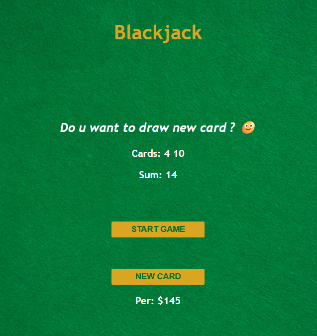
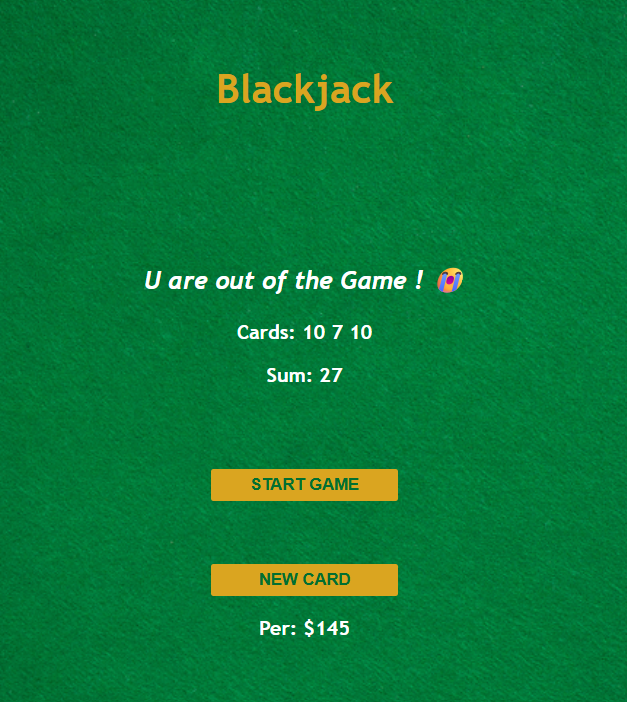

# Blackjack Game

## Overview
This is a simple web-based Blackjack game implemented using HTML, CSS, and JavaScript. The game simulates a basic version of the popular card game where the player aims to get a hand value as close to 21 as possible without exceeding it.

## How to Play
1. Click the "START GAME" button to begin a new round. You will be dealt two random cards.
2. The sum of your cards is displayed. If the sum is less than 21, you can choose to draw a new card by clicking "NEW CARD".
3. If your sum reaches exactly 21, you win with Blackjack!
4. If your sum exceeds 21, you lose the round.
5. The game tracks your status and displays messages to guide you.

## Features
- Random card generation with proper Blackjack values (Ace = 11, Face cards = 10)
- Real-time display of cards and sum
- Game state management (alive, blackjack, or out)
- Player info display (name and chips)
- Simple, casino-themed UI with a table background

## Screenshots

## Technologies Used
- **HTML**: Structure of the game interface
- **CSS**: Styling with casino theme and responsive layout
- **JavaScript**: Game logic, card generation, and DOM manipulation
